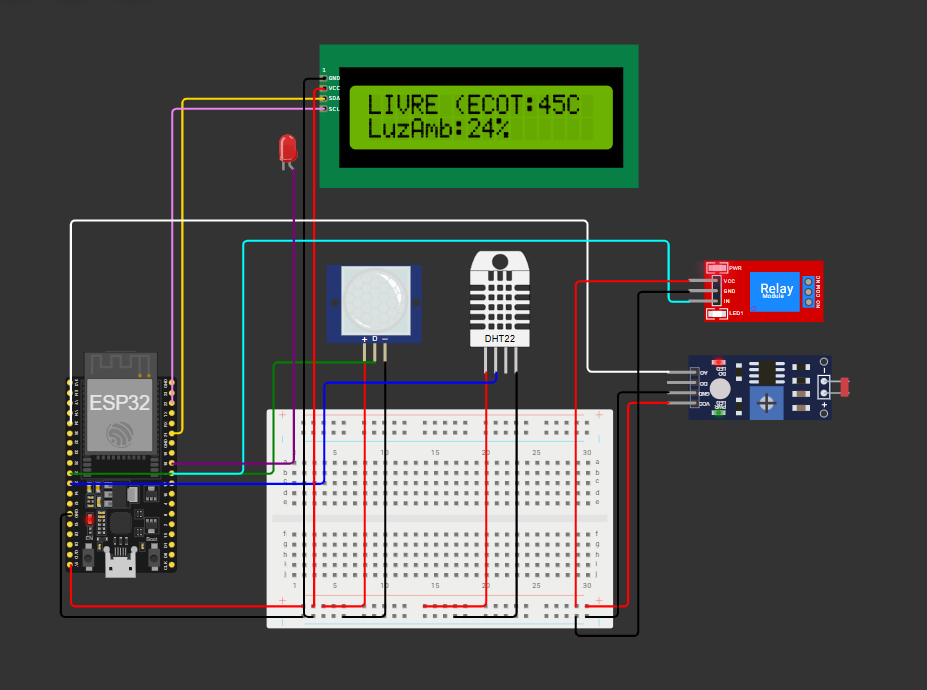
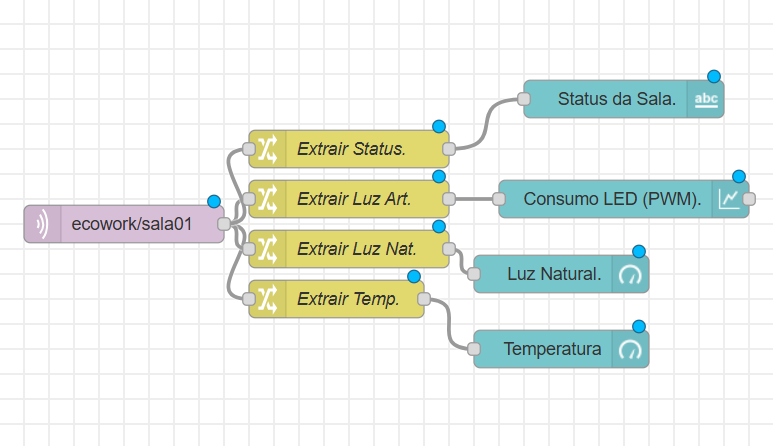
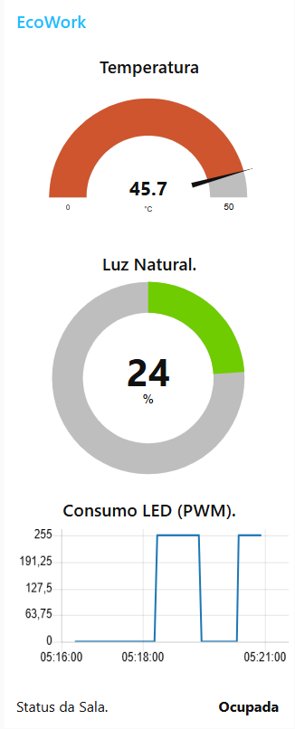

# EcoWork - Sistema Inteligente de Gestão de Salas e Sustentabilidade


## 👨‍💻 Integrantes da Equipe
* **Caio Nascimento Battista** - RM561383
* **Manoah Leão** - RM563713

---

## 📝 Descrição do Projeto

### O Problema
Muitos escritórios e ambientes corporativos desperdiçam energia elétrica mantendo luzes artificiais e sistemas de climatização ligados em salas vazias ou em momentos onde a luz natural seria suficiente.

### A Solução: EcoWork
O **EcoWork** é um sistema IoT baseado em ESP32 focado na eficiência energética. Ele monitora a ocupação da sala e as condições ambientais para automatizar o controle de dispositivos, garantindo economia sem sacrificar o conforto.

**Principais Funcionalidades:**
1.  **Detecção de Presença (PIR):** Ativa o sistema apenas quando a sala está ocupada.
2.  **Modo ECO Automático:** Se não houver movimento por um tempo determinado (configurado para 10s em testes), o sistema desliga relés e luzes.
3.  **Light Harvesting (Colheita de Luz):** Ajusta a intensidade da iluminação LED (via PWM) inversamente à luz natural detectada pelo LDR. Se houver muita luz solar, a luz artificial é reduzida ou desligada.
4.  **Monitoramento Climático:** Alerta se a temperatura ultrapassar 24°C enquanto a sala estiver ocupada.
5.  **Dashboard em Tempo Real:** Integração via MQTT com Node-RED para visualização de dados.

---

## 🛠️ Hardware e Tecnologias

* **Microcontrolador:** ESP32
* **Sensores:**
    * DHT22 (Temperatura e Umidade)
    * PIR (Sensor de Movimento)
    * LDR (Sensor de Luz - Fotoresistor)
* **Atuadores:**
    * Relé (Simulando Ar Condicionado/Tomadas gerais)
    * LED (Simulando iluminação dimerizável)
    * Display LCD 16x2 I2C
* **Protocolos:** MQTT, WiFi.

---

## 🔌 Documentação da Interface MQTT

O dispositivo publica dados periodicamente no broker MQTT público.

* **Broker:** `44.223.43.74` 
* **Porta:** `1883`
* **Tópico de Publicação:** `ecowork/sala01`

### Estrutura do Payload (JSON)
O dispositivo envia uma string JSON a cada 2 segundos (para fins de teste) com o seguinte formato:

```json
{
  "sala": "Sala01",
  "status": "Ocupada",    // "Ocupada" ou "Livre"
  "temp": 25.5,           // Temperatura em Celsius
  "hum": 60.0,            // Umidade Relativa em %
  "luz_nat": 85,          // Luz Natural em % (0-100)
  "luz_art": 0,           // Nível do PWM do LED (0-255)
  "alerta": 1             // 1 se Temp > 24°C, 0 caso contrário
}
```

---

## 💻 Como Replicar (Instruções)

### 1. Simulação Online (Wokwi)
Você pode acessar e testar o projeto diretamente no navegador através do link abaixo:

🔗 **[Acessar Simulação no Wokwi](https://wokwi.com/projects/448075828104894465)**

### 2. Configuração Física
1.  Monte o circuito conforme o diagrama na pasta `/docs`.
2.  Instale as bibliotecas necessárias na Arduino IDE:
    * `LiquidCrystal I2C`
    * `DHT sensor library`
    * `PubSubClient`
3.  Carregue o código disponível em `/src/main.cpp` para o ESP32.

### 3. Dashboard (Node-RED)
1.  Instale o Node-RED e o pacote `node-red-dashboard`.
2.  Importe o arquivo `dashboard/node-red-flows.json`.
3.  Acesse o dashboard em `http://localhost:1880/ui`.

---

## 📸 Imagens e Demonstração

### Diagrama do Circuito


### Dashboard Node-RED



### Vídeo Explicativo
Assista à demonstração completa do funcionamento e explicação do código no YouTube:
🔗 **youtube.com/watch?v=tavAso5dFQw&feature=youtu.be**
